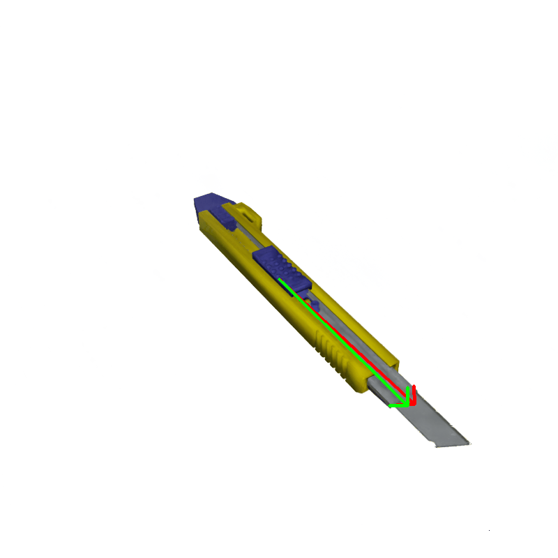
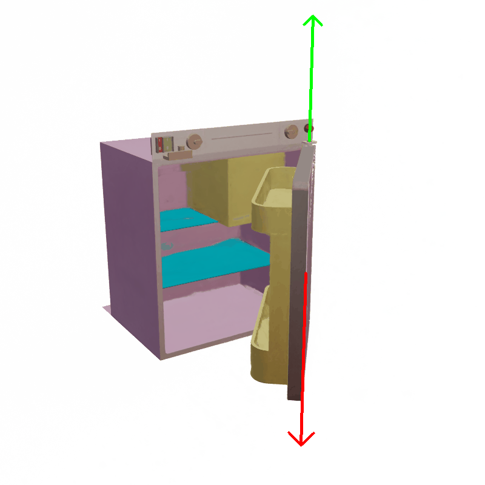

<div align = "center">

# Articulate your NeRF: Unsupervised articulated object modeling via conditional view synthesis

</div>

[Jianning Deng](https://djning.github.io/), [Kartic Subr](https://homepages.inf.ed.ac.uk/ksubr/), [Hakan Bilen](https://homepages.inf.ed.ac.uk/hbilen/)

[](https://arxiv.org/abs/2406.16623) 

This is the official repository of **Articulate your NeRF: Unsupervised articulated object modeling via conditional view synthesis**. For technical details please refer to our paper on NeurIPS 2024:


## Setup

1. Create and activate a new environment with Anaconda for this project:
```bash
conda create -n art_nerf python=3.10
conda activate art_nerf
```
2. Install dependency

```bash
./install.sh
```

## Data

Coming soon...

## Train/Val/Test

Use the following command to train from scratch

```bash
# train the static model
python train_static.py --config configs_static/stapler.json

# train the articulated model
python train_art.py --config configs_art/stapler.json
```

Change the config file for the object you want.

## Visualization

### Sapien Dataset

     


### Real-world scan


## Citation
If you find our work useful in your research, please consider citing:


```shell
@article{deng2024articulate,
  title={Articulate your NeRF: Unsupervised articulated object modeling via conditional view synthesis},
  author={Deng, Jianning and Subr, Kartic and Bilen, Hakan},
  journal={arXiv preprint arXiv:2406.16623},
  year={2024}
}
```


